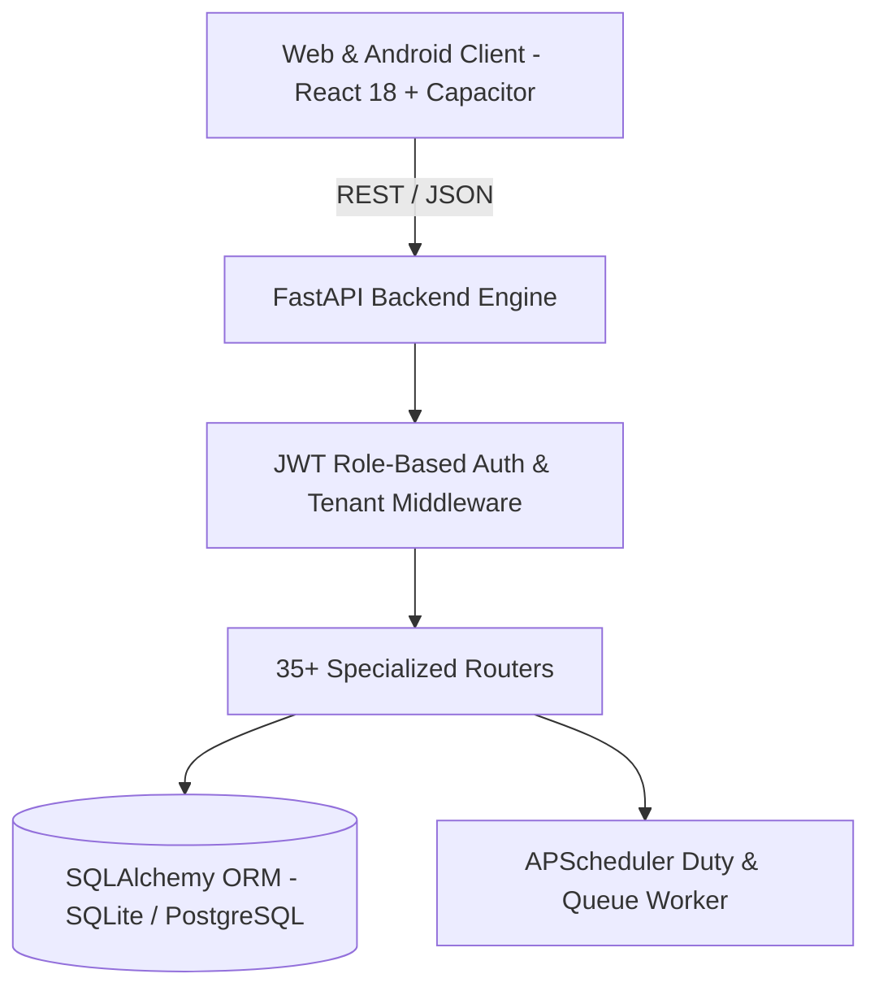

# 🏥 Enterprise Hospital Management & Clinical ERP System (SaaS)

<p align="center">
  
  
  
  
  
  
</p>

---

## 📌 Executive Overview

This is an end-to-end, multi-tenant **Hospital Management & Clinical ERP Platform** engineered for modern hospitals, medical colleges, and specialty clinics. The system automates the entire patient lifecycle from triage and outpatient departments (OPD) to inpatient admissions, ICU tracking, diagnostic laboratory workflows, operation theatre scheduling, pharmacy inventory, and billing/insurance processing.

Designed with **multi-tenant data isolation**, role-based access control (RBAC), and multi-platform accessibility (Web + Android via Capacitor).

---

## 🌟 Key Functional Modules (35+ Specialized Services)

### 1. Clinical & Patient Care
- **OPD & Triage Management:** Fast-track token queuing, vitals recording, and consultant doctor dispatching.
- **Inpatient Admissions & Bed Allocation:** Dynamic bed occupancy tracking across General Wards, Private Rooms, and Isolation Units.
- **Emergency Department (ED):** Priority triage (Red/Yellow/Green codes), rapid resuscitation logging, and trauma tracking.
- **ICU & Critical Care:** Continuous vital trend monitoring, ventilator tracking, and arterial line charts.
- **Operation Theatre (OT):** Surgical team scheduling, pre-op checklists, anesthesia notes, and recovery tracking.
- **TMO & House Officer (HO) Training Portal:** Clinical duty rosters, supervisor case sign-offs, and rotational logbooks.

### 2. Diagnostic & Ancillary Services
- **Laboratory Information System (LIS):** Test requisitioning, automated sample barcode mapping, reagent tracking, and verified PDF lab reports.
- **Radiology (RIS):** X-Ray, CT, MRI, and Ultrasound appointment scheduling and PACS integration links.
- **Blood Bank Management:** Donor registries, blood group inventory tracking, cross-matching, and component separation (PRBC, FFP, Platelets).
- **CSSD (Central Sterile Services):** Autoclave batch tracking, instrument sterilization logs, and tray issuance.

### 3. Pharmacy, Inventory & Supplies
- **Inpatient & Outpatient Pharmacy:** Prescription dispensing, barcode scanning, formulary search, and drug interaction alerts.
- **Hospital Supply Chain & Inventory:** Real-time stock depletion alerts, purchase orders, expiry date tracking, and minimum stock alerts.
- **Biomedical Engineering:** Medical device maintenance schedules, breakdown tickets, calibration logs, and AMC contracts.

### 4. Hospital Operations, Facilities & Security
- **Ambulance Dispatch:** Emergency vehicle allocation, driver contact, and GPS dispatching.
- **Dietetics & Food Services:** Patient dietary restriction charts, calorie planning, and meal delivery audits.
- **Infection Control & Surveillance:** Hospital-Acquired Infection (HAI) tracing and isolation protocols.
- **Housekeeping & Waste Management:** Ward sanitization checklists and biomedical waste segregation logs.
- **Mortuary Services:** Deceased record keeping, cold storage tracking, and handover documentation.
- **Security & Visitor Passes:** Gate entry passes and visitor time tracking.

### 5. Administration, HR & Finance
- **Multi-Tenant SaaS Architecture:** Tenant isolation allowing multiple clinics or hospital branches on a single deployment.
- **Dynamic Duty Shift Scheduler:** Automated shift scheduling, swap requests, and leave approval workflows.
- **Billing & Revenue Cycle Management (RCM):** Consolidated patient invoices, itemized room/medication charges, payment gateways, and insurance claims.
- **HR & Staff Management:** Staff payroll, attendance logging, credentials tracking, and role assignments.

---

## 🏛️ Architecture & Tech Stack



- **Backend:** Python 3.10+, FastAPI, SQLAlchemy, Pydantic, APScheduler, Passlib (bcrypt), PyJWT.
- **Frontend:** React 18, Vite, Tailwind CSS, Lucide Icons, Axios.
- **Mobile Engine:** Capacitor 6+ (Builds native Android APK).
- **Desktop Wrapper:** PyInstaller / Inno Setup build configurations.

---

## 🚀 Quick Start Guide

### Prerequisites
- Python 3.10+
- Node.js 18+ & npm
- Git

### 1. Backend Setup
```bash
cd backend
python -m venv venv
# Windows:
.\venv\Scripts\activate
# Linux/macOS:
source venv/bin/activate

pip install -r requirements.txt

# Seed multi-tenant database with roles and initial hospital data
python seed_multi_tenant_saas.py

# Start development server
uvicorn app.main:app --reload --port 8000
```
Interactive Swagger documentation will be available at: `http://localhost:8000/docs`

### 2. Frontend Setup
```bash
cd ../frontend
npm install
npm run dev
```
Open `http://localhost:5173` in your browser.

---

## 👥 Default Demo Roles & Credentials

For local evaluation, the database can be initialized with default department accounts:

| Department / Role | Demo Email | Access Level |
|---|---|---|
| **System Admin** | `admin@hospital.local` | Full system governance & settings |
| **Consultant Doctor** | `doctor@hospital.local` | Clinical OPD, inpatient visits, prescriptions |
| **Nurse Supervisor** | `nurse@hospital.local` | Vitals, bed management, medication admin |
| **Pharmacist** | `pharmacist@hospital.local` | Dispensing, stock & expiry management |
| **Lab Technician** | `lab@hospital.local` | Diagnostic tests & verified lab reports |
| **Receptionist** | `reception@hospital.local` | Patient check-in, token issuing, appointments |
| **Billing Specialist**| `billing@hospital.local` | Invoices, payments, and discharge summaries |

*(Default password for demo accounts: `demoPass123` / see seeded credentials in config)*

---

## 🔒 Security & Data Privacy
- **Strict Tenant Separation:** Middleware prevents cross-tenant data leakage between hospital branches.
- **Encrypted Credentials:** Passwords hashed with bcrypt; tokenized session authentication using JWT.
- **Audit Trails:** Critical actions (admissions, prescriptions, billing overrides) are logged with timestamps and user identifiers.

---

## 📄 License
This project is licensed under the [MIT License](LICENSE).